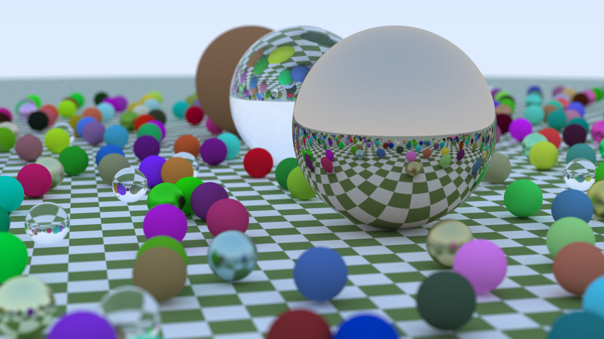

# RTWeekend
* CPU path tracer based on Ray Tracing in One Weekend series.
* Modified it to resemble HLSL and DirectX Raytracing (DXR) with the posibility to use TraceRay, hit shaders, [ray gen](https://github.com/INedelcu/RTWeekend/blob/4c4b512185c12f6150be86e9f3c6fcffe9b9411b/RTWeekend/Main.cpp#L51) and miss shaders direcly in C++.
* Added multi-threading support using enkiTS jobs system.
* Added path tracing progress feedback.

